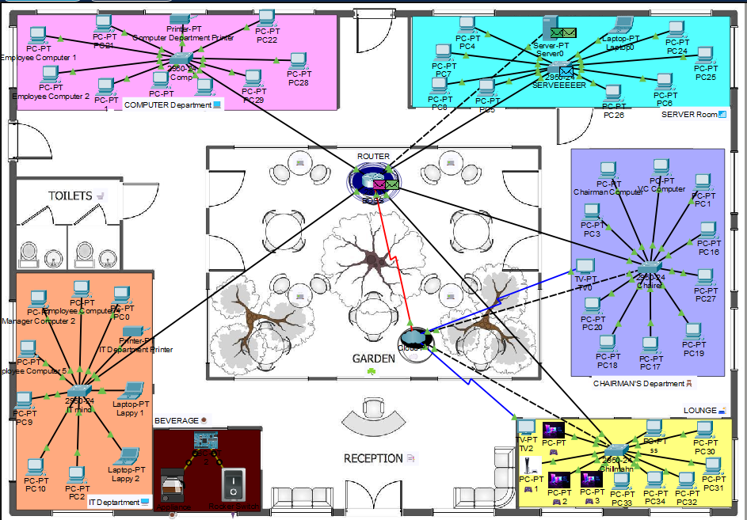

# Enterprise Network Infrastructure Simulation

A structured LAN simulation of a real-world office environment, built in **Cisco Packet Tracer**. The goal was to model how departments in an actual organization are segmented, connected, and made to communicate — not just get packets from A to B.

<div align="center">
  
  <br/>
  <sub>Full network topology — designed and tested in Cisco Packet Tracer</sub>
</div>

---

## What's being simulated

A multi-department office network with centralized routing and a dedicated server room. Each department has its own switch, and all traffic flows through a central router.

| Department | Devices |
|---|---|
| Computer Department | PCs, Printer, Switch |
| IT Department | PCs, Laptops, Printer |
| Chairman's Office | PCs, TV, Switch |
| Server Room | Server, PCs, Laptop |
| Lounge | Smart devices, PCs |
| Reception | Central office area |

---

## How it's structured

```
Cisco Packet Tracer
├── Routers         — inter-department routing
├── Switches        — per-department LAN
├── End devices     — PCs, laptops, printers, servers
└── Server room     — centralized resource access
```

IP addressing is manually configured across all devices. Communication is verified end-to-end using ICMP (ping) simulation.

---

## Key concepts covered

- Router and switch configuration from scratch
- Department-level network segmentation
- IP addressing across multiple subnets
- Packet flow tracing and real-time simulation mode
- Centralized server connectivity
- Enterprise infrastructure planning

---

## What's next

A few things I want to add when I revisit this:

- VLAN segmentation per department
- DHCP server for dynamic addressing
- ACL rules for inter-department access control
- Firewall and basic IDS integration
- Wireless access points for the lounge area

---

## Files

```
├── Enterprise-Network.pkt   — Packet Tracer project file
├── topology.png             — network diagram
└── README.md
```

---

*Built as part of learning enterprise networking fundamentals. Open the `.pkt` file in Cisco Packet Tracer to explore or modify the topology.*
